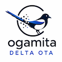

# Ogamita Delta OTA

**`delta-ota`** is an over-the-air software-distribution system for
large packages (≥ 2 GB).  After an initial full download, every
upgrade transfers only a binary delta (bsdiff in v1) between the
user's installed release and the targeted release — typically a
few percent of the full payload.

Owned and distributed by **[Ogamita Ltd.](https://ogamita.com)**

---

## Executive summary

Shipping software to thousands of users with multi-GB binary
artefacts is hard. Vanilla auto-updaters re-download the whole
payload every release. CDNs make it cheap to distribute, but they
do nothing about the time and bandwidth that *each user* loses
every time. Users on flaky Wi-Fi or constrained corporate links
fall behind, get stuck on broken intermediate states, or simply
stop updating.

Ogamita Delta OTA gives you a binary-delta upgrade pipeline that
ships **the change between two releases, not the whole release**.
A typical 2 GB monthly upgrade transfers about 20 MB —
roughly 1 % of a full re-install. The client-side library is a
single self-contained binary per OS (Windows, macOS, Linux), with
no DLL hell, no admin rights required, no runtime to install.
Failed downloads or interrupted patches never break the running
installation: the agent only flips the active distribution once
the new bytes have been fully validated on disk.

The system is dual-licensed: AGPL-3.0-or-later for open-source use,
**commercial licences from Ogamita Ltd.** for proprietary
distribution. See [Licensing](#licensing) below or contact
[`sales@ogamita.com`](mailto:sales@ogamita.com).

---

## Features

- Binary deltas via `bsdiff` (default) or `xdelta3`, content-addressed
  by SHA-256.
- Deterministic blobs (byte-identical builds) so deltas stay tight.
- Atomic on-disk switch-over on the client: a failed download or
  patch never breaks the running installation.
- Multiple releases coexist on the server as long as any client
  still uses them; users may skip releases.
- Server-side classifications and channels (`stable` / `beta` /
  `canary` / per-customer) for staged rollouts.
- Recovery tool with multi-step rollback to known-good "anchor"
  versions.
- Server in **Common Lisp (SBCL + Woo)** with kernel-level
  `sendfile(2)` for GB-class blobs.
- Client (`libota` + `ota-agent`) in **Go**, single static binary
  per OS, no runtime dependencies, no `cgo`, no DLL hell.
- Self-contained: `bsdiff`, `xdelta3` and tar implementations are
  *vendored* under permissive licences (MIT / BSD / Apache-2.0)
  and built into the project — no system tools required at runtime.
- HTTPS / mTLS, Ed25519 manifest signatures, replay/downgrade
  protection.
- Deployable as a single dedicated server or as a Kubernetes
  workload with PostgreSQL + S3-compatible blob storage.

## Architecture

```
+---------------------------+        +-------------------------+
|   Developer workstation   |        |   User workstation      |
|   (Win/macOS/Linux)       |        |   (Win/macOS/Linux)     |
|                           |        |                         |
|     ota-admin CLI         |  HTTPS |    ota-agent + libota   |
|     (publishes releases)  +------->+    (installs / upgrades)|
+---------------------------+        +-------------------------+
              |                                    ^
              |                                    |
              v                                    |
   +-------------------------------------------------+
   |                ota-server (Linux)               |
   |   HTTP/JSON API · Woo + sendfile · SQLite/PG    |
   |   bsdiff / xdelta3 patch builder · Ed25519      |
   |   blobs/patches on local FS or S3-compatible    |
   +-------------------------------------------------+
```

## Datasheet

System limits, operational figures, boundaries, compatibility
commitments and standards live in [docs/delta-ota-datasheet.org](docs/delta-ota-datasheet.org).
A printable PDF is generated by `make docs-pdf` (output in
`build/docs/delta-ota-datasheet.pdf`).

## Status

Pre-1.0.  See [docs/ota-implementation-plan.org](docs/ota-implementation-plan.org)
for the phased delivery plan.

## Documentation

- [docs/ota-specifications.org](docs/ota-specifications.org) — formal specification.
- [docs/ota-implementation-plan.org](docs/ota-implementation-plan.org) — delivery plan.
- [docs/dependencies.org](docs/dependencies.org) — pinned vendored sources and licences.
- [docs/THIRD_PARTY_LICENSES.org](docs/THIRD_PARTY_LICENSES.org) — aggregated upstream licences.
- [CLAUDE.md](CLAUDE.md) — engineering rules for this repo.

## Quick start (development)

Requires Docker.

```sh
git clone https://gitlab.com/ogamita/delta-ota.git
cd delta-ota
make vendor-verify           # check vendored sources are unmodified
docker compose -f docker/docker-compose.yml up --build
```

Once the stack is up:

```sh
# publish a sample release from a developer workstation
./bin/ota-admin publish ./examples/hello/ \
    --software hello --version 1.0.0

# install it from a user workstation
./bin/ota-agent install hello
```

For a non-Docker development setup (SBCL + Go installed locally):

```sh
make setup       # check toolchain, install Lisp deps via Quicklisp
make build       # build server, admin, libota, ota-agent
make test        # unit + integration tests
make run-server  # start ota-server on localhost:8443
```

## Deployment

Two supported topologies:

1. **Single dedicated host** — typical for customer-hosted deployments
   in their own data centre.  SQLite catalogue, filesystem blob
   storage, systemd unit, OS-managed TLS certificates.

2. **Kubernetes** — for cloud deployments.  PostgreSQL for the
   catalogue, S3 / S3-compatible (MinIO, AWS S3, Scaleway, OVH, …)
   for blobs and patches, the server image scales horizontally
   behind a load balancer.

The same container image (`registry.gitlab.com/ogamita/delta-ota/server`)
serves both topologies; the storage and database backends are
selected in `ota.toml`.

The server image is published as a **multi-arch manifest** for
`linux/amd64` and `linux/arm64`, so it pulls natively on x86_64
cloud hosts and on Apple-silicon (macOS arm64) developer machines
under Docker Desktop.

## Hosting and contributing

- Primary repository: [https://gitlab.com/ogamita/delta-ota](https://gitlab.com/ogamita/delta-ota)
- Mirror: [https://github.com/ogamita/delta-ota](https://github.com/ogamita/delta-ota)

The GitLab repository is authoritative.  Pull requests on the
GitHub mirror are accepted but rebased onto the GitLab pipeline.

Contributions require a Developer Certificate of Origin sign-off
(`git commit -s`).  See [CONTRIBUTING.md](CONTRIBUTING.md) once
published.

## Licensing

`delta-ota` is dual-licensed:

### Open source — AGPL-3.0-or-later

`delta-ota` is released under the **GNU Affero General Public
License, version 3 or later** (AGPL-3.0-or-later).  See
[LICENSE](LICENSE).  In short:

- you may use, study, modify, and redistribute the software;
- if you run a *modified* version on a server that is reachable
  over a network, you must offer the corresponding modified source
  to the users of that service;
- derivative works must themselves be licensed AGPL-3.0-or-later.

The AGPL applies to the `delta-ota` server, the admin CLI,
`ota-agent`, and `libota` in their entirety.  Linking your own
application against `libota` makes that application a derivative
work under the AGPL.  Read the licence text for the precise terms.

### Commercial

If the AGPL is incompatible with your distribution model — for
example, if you ship `libota` as part of a proprietary application,
or run a modified server without offering source to its users —
**commercial licences are available from Ogamita Ltd.**

Commercial licences also typically include:

- the right to ship `libota` linked into proprietary applications;
- support and maintenance options;
- guaranteed response times for security fixes;
- on-premises deployment assistance and customisation.

Contact: **`sales@ogamita.com`** — please include a brief
description of your intended deployment and distribution model.

## Trademarks

*Ogamita* and *Ogamita Delta OTA* are trademarks of Ogamita Ltd.
The AGPL grants no trademark rights; see [LICENSE](LICENSE) and
the relevant trademark policy.

## Copyright

Copyright © 2026 **Ogamita Ltd.** and contributors.  All rights
reserved.
